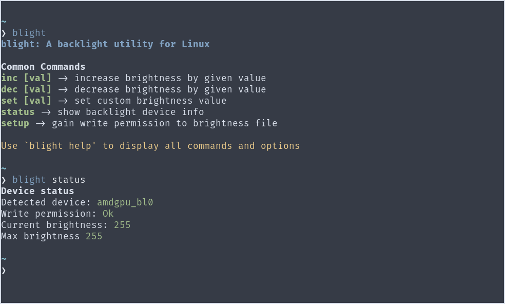
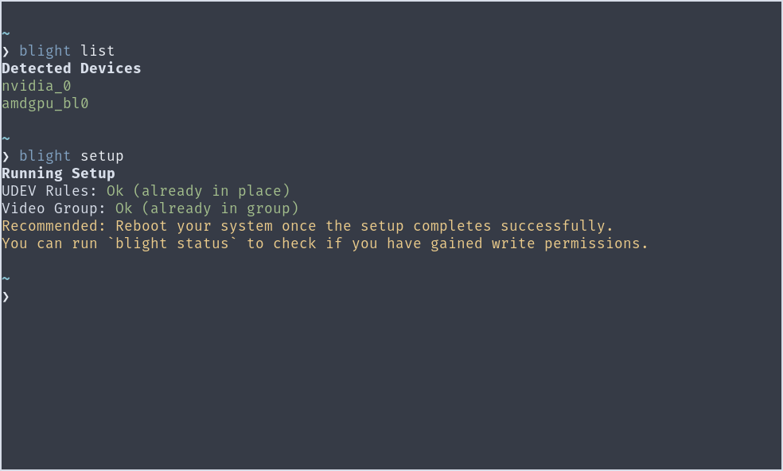

# blight

*(Credits: Sneha Sundar, for generating this lovely image for blight using DALL·E 2)*

> "And man said, 'let there b-light' and there was light." - Some Book 1:3

Primarily, a hassle-free CLI utility to manage backlight on Linux; one that plays well with hybrid GPU configuration and proprietary drivers.

The parts which blight relies on to make backlight changes, are also exposed through the library aspect of this crate, which can be used like any other Rust library by using the command `cargo add blight` in your Rust project. The CLI utility, on the other hand, can be installed by running `cargo install blight`.

> **Note**
> This page contains documentation for the CLI. For library docs, visit [docs.rs](https://docs.rs/blight/).

> **Warning**
> For this program to run without root privileges, the user needs to be in the video group and might need udev rules to allow write access to brightness files. Read more about it [here](https://wiki.archlinux.org/title/Backlight#ACPI). You can gain required permissions by using the helper script that comes with blight by running `sudo blight setup` once or you could do it manually too. If not, you'd have to run the program with `sudo` every time.

## Screenshots

## About
A lot of Linux backlight utilities often fail to detect the right backlight device to control in laptops that ship with Intel or Amd iGPUs and an Nvidia dGPU with proprietary drivers. This utility aims to solve that problem by prioritizing integrated graphic devices, followed by dedicated Nvdia GPU and ACPI kernel module. This means that you do not have to manually specify which device is currently active whenever you switch between your iGPU and dGPU using the MUX switch. Other than that, *blight* also implements the `sweep` functionality, which lets you change brightness in a smooth sweeping manner, rather than applying sudden jerky increments/decrements.

In principle, blight should work on any GNU/Linux distro, and even on systems without hybrid GPU configuration. However, it has only been tested on Arch and Debian so far. Any feedback and bug reports will be greatly appreciated.

## Usage
Set custom shortcuts using your distro settings or pair it with a hotkey daemon like [sxhkd](https://github.com/baskerville/sxhkd) and you'll be good to go. *blight* doesn't execute any code if another instance is already running, so do not worry about spamming the key that triggers it.

### Commands
- Display help `blight` (quick help) or `blight help`
- Display status `blight status` OR `blight status -d device_name`
- Run first time setup script (for write permissions) `sudo blight setup`
- List all backlight devices `blight list`
- Increase brightness `blight inc 5` (increases by 5%, instead of default 2%)
- Decrease brightness `blight dec 10` (decrease by 10%)
- Increase/decrease brightness smoothly `blight inc 10 -s` OR `blight dec 10 --sweep`
- Set custom brightness value `blight set 50`
- Increase brightness for specific device `blight inc 2 -d nvidia_0`
- Save/restore brightness `blight save` OR `blight restore -d amdgpu_bl0`

Note: When specifying a device name, you need to specify optional values too if the command accepts them (see above example).

## Install
### Using Cargo
- `cargo install blight`
- Binary will be compiled to `$HOME:.cargo/bin`

### Compile from Source
- Clone repository
- `cd cloned-repo`
- `cargo build -r`

## Contribute
Coding, for me, is a hobby and I'm very much new to Rust and to programming as a whole. So if you notice anything in the code that can be improved, do open an issue to voice your opinion and pass on your suggestions. If you want to improve the code directly, please raise a pull-request, I'd be happy to collaborate and work to improve this together. Cheers!

